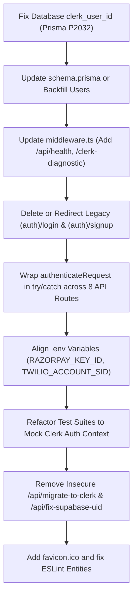

# Shanvi Hospitality CRM — Comprehensive Audit & Debugging Report

**Date & Time:** October 9, 2026  
**Target Application:** Shanvi Hospitality CRM (`travel-crm` v0.1.0)  
**Environment Audited:** Local Development (`http://localhost:3000`) & Supabase PostgreSQL (Port 6543)  
**Code Changes Made:** **0 (Strict Read-Only Audit per User Requirement)**

---

## 1. Executive Summary

A comprehensive architectural, runtime, database, security, and static code audit was conducted on the Shanvi Hospitality CRM repository. The application is built with **Next.js 15.1.7 (App Router)**, **React 19**, **Prisma 5.22.0**, **PostgreSQL (Supabase)**, **Clerk Authentication**, **Tailwind CSS**, and **Capacitor 8**.

While the application compiles successfully during `npm run build` (34 pages and routes compiled), **several critical runtime blockers prevent normal operations in staging and production**, most notably:
1. **Prisma Fatal Exception P2032** on user queries caused by nullable `clerk_user_id` values in PostgreSQL for existing users while the Prisma schema declares `clerkUserId` as non-nullable `String`.
2. **Orphaned / Dead Auth Routes** (`/login` and `/signup`) attempting to post to non-existent `/api/auth/*` endpoints while `middleware.ts` redirects unauthenticated traffic to `/`.
3. **Broken Automated Test Suites** (33 TypeScript errors and `server-only` runtime exceptions in Phase 1, 2, 5, and 6 tests).
4. **Third-party Credential Disconnects** (Razorpay and Twilio environment variable mismatches).
5. **Security Risks**: Unauthenticated database DDL migration endpoints exposed in `app/api/`.

---

## 2. System Status Matrix

| Component / Feature | Operational Status | Root Cause / Technical Finding | Severity |
| :--- | :--- | :--- | :--- |
| **Landing Page (`/`)** | 🟢 **Working** | Renders HTTP 200, clean Shanvi branding, contact details, CTA links. | None |
| **Clerk Sign-In (`/sign-in`)** | 🟢 **Working** | Renders HTTP 200, Clerk `SignIn` component loaded. | None |
| **Clerk Sign-Up (`/sign-up`)** | 🟢 **Working** | Renders HTTP 200, Clerk `SignUp` component loaded. | None |
| **Legacy Login (`/login`)** | 🔴 **Broken** | Redirects to `/` via middleware. If reached, calls missing `/api/auth/login` (404). | High |
| **Legacy Signup (`/signup`)** | 🔴 **Broken** | Redirects to `/` via middleware. If reached, calls missing `/api/auth/signup` (404). | High |
| **Clerk Diagnostic (`/clerk-diagnostic`)** | 🟡 **Partially Working** | Blocked by middleware (redirects to `/` when unauthenticated). Has ESLint syntax issues. | Medium |
| **Health Check (`/api/health`)** | 🟡 **Partially Working** | Functional DB query logic, but blocked by middleware (redirects to `/` when unauthenticated). | Medium |
| **Dashboard (`/dashboard`)** | 🟡 **Protected / At Risk** | Protected by auth. Once logged in, user data queries risk crashing due to Prisma `P2032`. | Critical |
| **User & Staff Queries (`/api/staff`, `/api/admin/analytics`)** | 🔴 **Crashing at Runtime** | Throws Prisma `P2032` due to `NULL` `clerk_user_id` on existing users in database. | Critical |
| **Leads & Pipeline (`/api/leads`)** | 🟡 **At Risk** | Queries crash if `assignedAgent` or `createdBy` points to a user with `clerk_user_id = null`. | High |
| **Automated Test Suites (`npm run test:*`)** | 🔴 **Failing (100% Fail)** | 33 TS compile errors (`supabaseUid`) + `server-only` runtime crash in Node context. | High |
| **Production Build (`npm run build`)** | 🟢 **Working** | Completed in 44s, generating 34 dynamic and static routes. | None |
| **Favicon (`/favicon.ico`)** | 🔴 **Broken (404)** | Missing `favicon.ico` in `/public` and `/app`. | Low |
| **WhatsApp Dispatch (`/api/whatsapp/send`)** | 🟢 **Working (Fallback)** | Falls back cleanly to `https://wa.me/...` deep links even without Twilio SID. | Low |
| **Payment Orders (`/api/payments/create-order`)** | 🔴 **Broken** | Crashes with `Razorpay credentials not configured` due to variable name mismatch. | High |
| **Telephony Calls (`/api/calls/initiate`)** | 🔴 **Broken** | Crashes with `Twilio credentials not configured` due to variable name mismatch. | Medium |
| **PDF Itinerary & Voucher Generation** | 🟢 **Working** | PDFKit buffers generated using built-in PostScript fonts (`Helvetica`). | Low |

---

## 3. Deep-Dive Findings & Debugging Analysis

### Finding 1: Fatal Prisma Deserialization Bug (Error P2032) [CRITICAL]
* **Location:** Live Database `users` table vs [prisma/schema.prisma](file:///d:/projects/CRM/prisma/schema.prisma#L39-L63)
* **Observed Error:**
  ```text
  PrismaClientKnownRequestError: 
  Invalid `prisma.user.findMany()` invocation:
  Error converting field "clerkUserId" of expected non-nullable type "String", found incompatible value of "null".
  Code: 'P2032', Model: 'User', Field: 'clerkUserId'
  ```
* **Investigation:**
  A direct SQL inspection of PostgreSQL revealed the following users in the database:
  1. `cmu9lqywk0002kkw4s934lgyo` — `DEVELOPER` (`developernot6979@gmail.com`) → `clerk_user_id = NULL`
  2. `cmu9lu6t10005kkw4n6nte0vj` — `DEVELOPER` (`developernot6979@gmail.com`) → `clerk_user_id = NULL`
  3. `cmuibzypj00023ky7gsejspcg` — `himanshu gupta` (`himanshu@shanvihospitality.in`) → `clerk_user_id = NULL`
  4. `cmuwa18qc0001j46djix8zjg6` — `User` (`energyengine007@gmail.com`) → `clerk_user_id = "user_3KJDYKMLdftAAMNiJAFaRshHgBA"`
* **Impact:**
  Because `schema.prisma` declares `clerkUserId String @unique @map("clerk_user_id")` without a nullable modifier `?`, **any query fetching rows with `NULL` will immediately throw an uncaught P2032 exception and crash the API handler**.
  This crashes:
  - `/api/staff`
  - `/api/admin/analytics`
  - `/api/leads` (when including `assignedAgent` or `createdBy`)
  - Any dashboard view loading team members.

---

### Finding 2: Dead Legacy Auth Routes & Redirection Traps [HIGH]
* **Location:** [app/(auth)/login/page.tsx](file:///d:/projects/CRM/app/%28auth%29/login/page.tsx#L34), [app/(auth)/signup/page.tsx](file:///d:/projects/CRM/app/%28auth%29/signup/page.tsx#L26), [middleware.ts](file:///d:/projects/CRM/middleware.ts#L5-L15)
* **Observed Behavior:**
  - Routes `/login` and `/signup` are legacy relics from the prior Supabase Auth setup.
  - In [app/(auth)/login/page.tsx:L34](file:///d:/projects/CRM/app/%28auth%29/login/page.tsx#L34):
    `fetch('/api/auth/login', ...)`
  - In [app/(auth)/signup/page.tsx:L26](file:///d:/projects/CRM/app/%28auth%29/signup/page.tsx#L26):
    `fetch('/api/auth/signup', ...)`
  - Directory `app/api/auth/` does not exist in the codebase.
  - In [middleware.ts:L5-15](file:///d:/projects/CRM/middleware.ts#L5-L15), `isPublicRoute` only recognizes:
    `['/', '/sign-in(.*)', '/sign-up(.*)', '/api/webhooks/clerk', '/manifest.json', '/service-worker.js', '/register-sw.js', '/icons/(.*)', '/favicon.ico']`
  - When an unauthenticated user navigates to `/login` or `/signup`, the middleware redirects them to `/`.
  - The landing page correctly links to `/sign-in` and `/sign-up`, making `/login` and `/signup` orphaned dead code that misleads users or developers.

---

### Finding 3: Inaccessible Diagnostic & Health Check Routes [MEDIUM]
* **Location:** [middleware.ts](file:///d:/projects/CRM/middleware.ts#L5-L15), [app/api/health/route.ts](file:///d:/projects/CRM/app/api/health/route.ts), [app/clerk-diagnostic/page.tsx](file:///d:/projects/CRM/app/clerk-diagnostic/page.tsx)
* **Observed Behavior:**
  - HTTP requests to `GET /api/health` and `GET /clerk-diagnostic` return `307 Temporary Redirect` to `/` for unauthenticated requests.
  - **Uptime Monitoring Failure**: Uptime monitors (Pingdom, Datadog, BetterUptime) polling `/api/health` will receive a 307 redirect instead of the 200/503 JSON health status.
  - **Diagnostic Page Locked**: The `/clerk-diagnostic` page was specifically created to diagnose Clerk setup issues when users cannot sign in, but it cannot be viewed unless the user is already signed in!

---

### Finding 4: Unhandled Exception Pattern in API Route Handlers [HIGH]
* **Location:** Multiple API routes using [lib/auth.ts:authenticateRequest](file:///d:/projects/CRM/lib/auth.ts#L164-L179)
* **Observed Code:**
  ```typescript
  export async function GET(request: NextRequest, { params }: ...) {
    const auth = await authenticateRequest(request, ['admin', 'staff_agent']);
    if (!auth.success) return auth.response;
    ...
  }
  ```
* **Flaw:**
  `authenticateRequest()` calls `requireRole()`, which **throws `new Error('Unauthorized: ...')` or `new Error('Forbidden: ...')`**.
  In the following 8 routes, `authenticateRequest()` is called **outside of any try/catch block**:
  1. [app/api/staff/[id]/route.ts](file:///d:/projects/CRM/app/api/staff/%5Bid%5D/route.ts#L16)
  2. [app/api/packages/custom/route.ts](file:///d:/projects/CRM/app/api/packages/custom/route.ts#L27)
  3. [app/api/leads/[id]/route.ts](file:///d:/projects/CRM/app/api/leads/%5Bid%5D/route.ts#L24)
  4. [app/api/leads/[id]/notes/route.ts](file:///d:/projects/CRM/app/api/leads/%5Bid%5D/notes/route.ts#L14)
  5. [app/api/leads/[id]/itinerary/route.ts](file:///d:/projects/CRM/app/api/leads/%5Bid%5D/itinerary/route.ts#L34)
  6. [app/api/itineraries/[id]/export/route.ts](file:///d:/projects/CRM/app/api/itineraries/%5Bid%5D/export/route.ts#L10)
  7. [app/api/itineraries/[id]/convert-booking/route.ts](file:///d:/projects/CRM/app/api/itineraries/%5Bid%5D/convert-booking/route.ts#L9)
  8. [app/api/employees/[id]/route.ts](file:///d:/projects/CRM/app/api/employees/%5Bid%5D/route.ts#L30)
* **Impact:**
  Any unauthorized or unauthenticated request results in an unhandled exception crashing the route handler with HTTP 500, rather than cleanly returning 401 Unauthorized or 403 Forbidden.

---

### Finding 5: Complete Failure of the Automated Test Suite [HIGH]
* **Location:** [tests/phase1.test.ts](file:///d:/projects/CRM/tests/phase1.test.ts), [tests/phase2.test.ts](file:///d:/projects/CRM/tests/phase2.test.ts), [tests/phase5.test.ts](file:///d:/projects/CRM/tests/phase5.test.ts), [tests/phase6.test.ts](file:///d:/projects/CRM/tests/phase6.test.ts)
* **Observed Errors:**
  1. **Static Typecheck (33 Errors):**
     `Property 'supabaseUid' does not exist on type 'User'`
     `Module '"@/middleware"' has no exported member 'middleware'`
  2. **Runtime Execution Error:**
     ```text
     Error: This module cannot be imported from a Client Component module. It should only be used from a Server Component.
         at auth (node_modules/@clerk/nextjs/src/app-router/server/auth.ts:83:3)
         at getCurrentUser (lib/auth.ts:32:28)
     ```
* **Explanation:**
  The test suites were authored for the original Supabase authentication architecture. When the application switched to Clerk, route handlers started calling `@clerk/nextjs/server`'s `auth()`. Standalone runner `tsx scripts/run-phase1-tests.ts` executes in a bare Node.js CLI process without Next.js server request context or cookies, causing Clerk's `server-only` check to throw immediately.

---

### Finding 6: Third-Party Environment Variable Mismatches [HIGH]

#### A. Razorpay Payment Gateway
* **Code Expectation** ([lib/razorpay.ts:L4](file:///d:/projects/CRM/lib/razorpay.ts#L4)):
  `process.env.RAZORPAY_KEY_ID` & `process.env.RAZORPAY_KEY_SECRET`
* **Configured in `.env`**:
  `PAYMENT_GATEWAY_KEY=sandbox_key_here`
  `PAYMENT_GATEWAY_SECRET=sandbox_secret_here`
* **Result**:
  Every payment creation via [app/api/payments/create-order/route.ts](file:///d:/projects/CRM/app/api/payments/create-order/route.ts) fails with `Razorpay credentials not configured`.

#### B. Twilio Telephony Integration
* **Code Expectation** ([lib/twilio.ts:L4](file:///d:/projects/CRM/lib/twilio.ts#L4)):
  `process.env.TWILIO_ACCOUNT_SID` & `process.env.TWILIO_AUTH_TOKEN`
* **Configured in `.env`**:
  `TELEPHONY_API_KEY=test_key_here`
  `TELEPHONY_API_SECRET=test_secret_here`
* **Result**:
  Click-to-call endpoint [app/api/calls/initiate/route.ts](file:///d:/projects/CRM/app/api/calls/initiate/route.ts) fails immediately.

#### C. Clerk Key Conflict (Local vs Production)
* In `.env.local`: `NEXT_PUBLIC_CLERK_PUBLISHABLE_KEY=pk_live_Y2xlcmsuc2hhbnZpaG9zcGl0YWxpdHktY3JtLnZlcmNlbC5hcHAk` (Live key bound to production domain).
* In `.env`: `NEXT_PUBLIC_CLERK_PUBLISHABLE_KEY=pk_test_YXJ0aXN0aWMta2lkLTQwMzQuY2xlcmsuYWNjb3VudHMuZGV2JA`.
* Next.js prioritizes `.env.local`. Running a live Clerk key on `localhost:3000` will fail Clerk domain authorization unless `localhost` is whitelisted in Clerk's live instance.

---

### Finding 7: Security Vulnerabilities [MEDIUM / HIGH]
* **Location:** [app/api/migrate-to-clerk/route.ts](file:///d:/projects/CRM/app/api/migrate-to-clerk/route.ts), [app/api/fix-supabase-uid/route.ts](file:///d:/projects/CRM/app/api/fix-supabase-uid/route.ts)
* **Risk:**
  Both endpoints execute raw database DDL (`ALTER TABLE`, `DROP INDEX`, etc.) and are protected only by a simple URL query parameter:
  `?secret=MIGRATE_NOW_2024` and `?secret=FIX_NOW`.
  They were marked as temporary one-time scripts, but remain live in the production routing table.
* **Supabase Service Role Key Placeholder:**
  In `.env`: `SUPABASE_SERVICE_ROLE_KEY=your_actual_service_role_secret_key_here`.

---

### Finding 8: Static Assets & ESLint Issues [LOW]
1. **Missing Favicon:** `/favicon.ico` returns 404. Neither `public/favicon.ico` nor `app/favicon.ico` exists.
2. **ESLint Errors:**
   - [app/clerk-diagnostic/page.tsx:L97](file:///d:/projects/CRM/app/clerk-diagnostic/page.tsx#L97): Unescaped double quotes.
   - [app/clerk-diagnostic/page.tsx:L115](file:///d:/projects/CRM/app/clerk-diagnostic/page.tsx#L115): `<a>` tag used instead of `<Link>`.
   - [app/onboarding/page.tsx:L52](file:///d:/projects/CRM/app/onboarding/page.tsx#L52): Unescaped apostrophe in `Let's`.

---

## 4. Recommended Fix Roadmap (For Future Implementation)



### Detailed Fix Instructions:

1. **Resolve Database P2032 Error:**
   - In PostgreSQL, backfill existing users:
     ```sql
     UPDATE users SET clerk_user_id = 'legacy_' || id WHERE clerk_user_id IS NULL;
     ```
   - OR in `prisma/schema.prisma`, allow nullable `clerkUserId`:
     ```prisma
     clerkUserId String? @unique @map("clerk_user_id")
     ```
     followed by `npx prisma generate`.

2. **Fix `middleware.ts`:**
   - Add public diagnostic routes:
     ```typescript
     const isPublicRoute = createRouteMatcher([
       '/',
       '/sign-in(.*)',
       '/sign-up(.*)',
       '/clerk-diagnostic',
       '/api/health',
       '/api/webhooks/clerk',
       '/manifest.json',
       '/service-worker.js',
       '/register-sw.js',
       '/icons/(.*)',
       '/favicon.ico',
     ]);
     ```

3. **Clean Up Legacy Auth:**
   - Remove `app/(auth)/login` and `app/(auth)/signup`, or place permanent redirects in them pointing to `/sign-in` and `/sign-up`.

4. **Synchronize Environment Variable Names:**
   - Rename in `.env`:
     - `PAYMENT_GATEWAY_KEY` → `RAZORPAY_KEY_ID`
     - `PAYMENT_GATEWAY_SECRET` → `RAZORPAY_KEY_SECRET`
     - `TELEPHONY_API_KEY` → `TWILIO_ACCOUNT_SID`
     - `TELEPHONY_API_SECRET` → `TWILIO_AUTH_TOKEN`

5. **Harmonize API Auth Error Handling:**
   - In `lib/auth.ts`, update `authenticateRequest` so it catches errors and returns `{ success: false, response: NextResponse.json({ error: err.message }, { status: ... }) }` instead of throwing unhandled errors.

6. **Fix Test Suites:**
   - Replace `.supabaseUid` with `.clerkUserId` in test fixtures.
   - Inject mock session headers or mock `auth()` for Clerk during test execution.

---

*Report generated by Antigravity Autonomous Audit Agent.*
